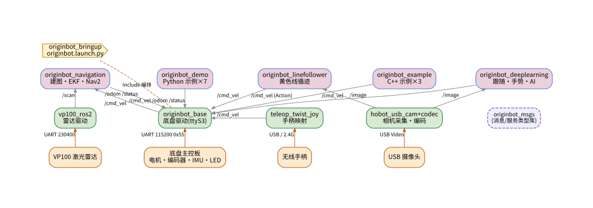

# OriginBot 工作区学习索引

> 本目录是对 `OriginBot 3.0_car` 工作区的**结构化学习文档**集合。
> 目标：不看代码也能快速建立全局认知，再按索引深入任意一个包。
> 阅读顺序建议：先看整体架构图 → 从下往上（驱动 → 启动 → 应用）。

---

## 软硬件整体架构图



图例：
- 🟩 驱动层：与硬件直接通信的节点（串口/雷达/相机/手柄）
- 🟨 编排层：launch 组合（`originbot_bringup`）
- 🟪 应用层：做决策的功能（导航/循迹/跟随/示例）
- 相关箭头 = 话题数据流；虚线箭头 = launch 包含 / 类型依赖 / 服务

---

## 文档总览（9 篇 + 1 张架构图）

### ① 驱动层（读懂"数据从哪来"）

| 文档 | 一句话要点 |
|---|---|
| [`originbot_base_结构说明.md`](./originbot_base_结构说明.md) | ★ 底盘驱动：串口**0x55 帧协议**、双线程、差速里程计、看门狗自动停车、LED/蜂鸣器/PID 服务 |
| [`originbot_driver_结构说明.md`](./originbot_driver_结构说明.md) | 设备驱动集散地：`serial_ros2`（串口库）、`vp100_ros2`（激光雷达 → /scan）、qpOASES 第三方库 |
| [`originbot_msgs_结构说明.md`](./originbot_msgs_结构说明.md) | 自研消息/服务：Status + Led/Buzzer/PID，全家共享的类型契约 |

### ② 编排层（读懂"如何一键启动"）

| 文档 | 一句话要点 |
|---|---|
| [`originbot_bringup_结构说明.md`](./originbot_bringup_结构说明.md) | 总电源开关：`originbot.launch.py` 组合底盘/雷达/相机，手柄遥控映射 |

### ③ 应用层（读懂"机器人在干什么"）

| 文档 | 一句话要点 |
|---|---|
| [`originbot_navigation_结构说明.md`](./originbot_navigation_结构说明.md) | 纯配置导航三件套：Cartographer 建图 + EKF 融合 + Nav2 导航 |
| [`originbot_demo_结构说明.md`](./originbot_demo_结构说明.md) | Python 入门七例：服务客户端 / 话题发布 / 订阅 / 图像 |
| [`originbot_example_结构说明.md`](./originbot_example_结构说明.md) | C++ 三例：键盘遥控 / Nav2 Action 客户端 / 二维码视觉伺服 |
| [`originbot_linefollower_结构说明.md`](./originbot_linefollower_结构说明.md) | 黄色线循迹：HSV 分割 + 重心偏差 + P 控制器（约百行） |
| [`originbot_deeplearning_结构说明.md`](./originbot_deeplearning_结构说明.md) | 地平线 RDK AI 套件：人体跟随 / 手势控制 / 深度学习循迹 |

---

## 推荐学习路线

```
第一层 打通底盘： 读 originbot_base → 跑 robot.launch → topic echo /odom → 遥控
第二层 增加感知： 装雷达/相机 → 认 originbot_driver、originbot_bringup
第三层 应用闭环： 循迹(linefollower) → 建图/导航(navigation) → 目标点(example)
第四层 进阶实验： demo 改造 / 手势跟随(deeplearning) → 设计与自己小车的对照实验
```

## 话题与接口速查（跨包联想记忆）

| 话题/动作 | 生产者 | 消费者 | 时钟/频率 |
|---|---|---|---|
| `/cmd_vel` (Twist) | 导航/遥控/循迹/AI | **originbot_base** → 串口 | 依上游 |
| `/odom` (Odometry) | **originbot_base** (100ms 定时 + 轮速帧触发) | demo / navigation(EKF) | 动态 |
| `/originbot_status` | **originbot_base** (100ms 定时) | demo/echo_status | 10 Hz |
| `/scan` (LaserScan) | vp100_ros2 (50Hz 轮询) | navigation(Cartographer/Nav2) | 8~15 Hz |
| `/image` (bgr8) | hobot_codec (相机链) | linefollower / deeplearning / demo | 相机帧率 |
| `/navigate_to_pose` (Action) | send_goal(example) | Nav2 | 事件型 |
| `originbot_led/buzzer` (Srv) | demo / deeplearning | **originbot_base** | 事件型 |
| `/odometry/filtered` | EKF(navigation) | 下游可选 | 可配 |
| TF 树 | base(odom→footprint) / static(→link→laser_link) | 全部 | — |

## 构建与运行速查

```bash
# 编译（工作区根目录）
colcon build --symlink-install   # 或单独构建某包
source install/setup.bash

# 最常用的三行：
ros2 launch originbot_bringup originbot.launch.py use_lidar:=true use_camera:=true   # 整机
ros2 run originbot_demo echo_odom                                                     # 看里程
ros2 run originbot_teleop originbot_teleop                                            # 键盘遥控
```

> 注：`originbot_base_结构说明.md` 另含详细的串口协议、成员函数表与学习路径，是全套文档的**地基**，务必先读。